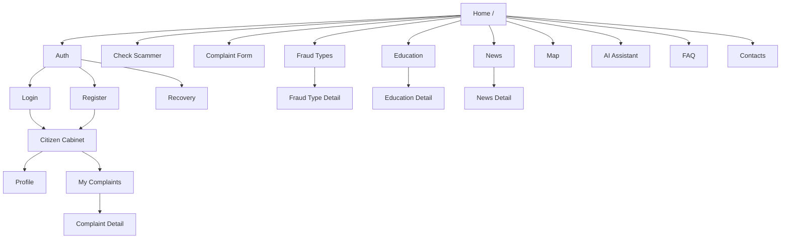
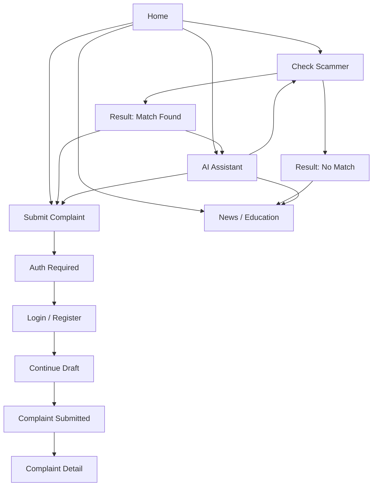

# Public Web UI/UX Specification
## SaqBol.kz

**Версия:** 1.0  
**Статус:** Public Web Product + UX + Frontend Specification  
**Цель:** спроектировать публичный интерфейс SaqBol.kz для граждан Республики Казахстан  
**Технологии:** Next.js, React, TypeScript, Tailwind CSS, responsive design, RU/KZ localization

---

## 0. Продуктовый и визуальный подход

### 0.1. Роль Public Web

Public Web должен решать три основные задачи:

- быстро привести гражданина к безопасному действию;
- упростить подачу жалобы и контроль ее статуса;
- обучать и предупреждать, а не только принимать обращения.

### 0.2. UX-принципы

- **Понятность с первого экрана**: на главной сразу видны 3 ключевых действия: `Подать жалобу`, `Проверить мошенника`, `Получить помощь`.
- **Низкая когнитивная нагрузка**: длинные сценарии делятся на шаги, сложные термины сопровождаются пояснениями.
- **Безопасность как часть интерфейса**: предупреждения, маскирование чувствительных данных, понятные статусы, доверительный тон.
- **State-first UX**: у каждой страницы предусмотрены loading, empty, partial-error и retry states.
- **Multilingual-first**: RU/KZ не как перевод постфактум, а как полноценные языковые версии.
- **Mobile-first citizen flows**: ключевые действия и формы оптимизированы под смартфон.

### 0.3. Визуальное направление

Стиль интерфейса:

- государственный;
- надежный;
- современный;
- спокойный и уверенный;
- без визуального шума и агрессивных маркетинговых паттернов.

### 0.4. Рекомендуемая дизайн-система

#### Typography

- Основной UI font: `IBM Plex Sans`
- Акцентный editorial font для новостей/обучения: `Source Serif 4`
- Моноширинный font для технических значений и ID: `IBM Plex Mono`

Причина выбора:

- хорошие кириллические и латинские наборы;
- строгий, институциональный, но современный вид;
- удобочитаемость на desktop и mobile.

#### Color direction

Рекомендуемые базовые токены:

```css
:root {
  --bg: #f4f7f8;
  --surface: #ffffff;
  --surface-muted: #eef3f4;
  --text: #0f2430;
  --text-muted: #556773;
  --primary: #0d5c63;
  --primary-strong: #083d43;
  --secondary: #1e7a73;
  --accent: #d89b2b;
  --success: #2b7a4b;
  --warning: #b8791a;
  --danger: #b24040;
  --border: #d9e3e7;
  --info: #2a6f97;
}
```

Комментарий по стилю:

- не использовать яркий consumer-tech стиль;
- не использовать фиолетовую палитру;
- визуально опираться на оттенки глубокого бирюзово-синего, серо-белого и теплого янтарного акцента.

### 0.5. Основные шаблоны UI

- Sticky top navigation на desktop
- Bottom action bar на mobile для ключевых действий
- Step-based forms
- Карточки с четкой иерархией данных
- Informational side panels и inline hints
- Status chips и callout banners
- Floating AI-assistant widget

---

## 1. Информационная архитектура

### 1.1. Верхний уровень разделов

Public Web делится на 5 продуктовых блоков:

1. **Awareness**
   - главная;
   - виды мошенничества;
   - обучающие материалы;
   - новости;
   - FAQ;
   - контакты.

2. **Action**
   - подача жалобы;
   - проверка мошенника;
   - AI-ассистент.

3. **Personal Area**
   - авторизация;
   - регистрация;
   - восстановление доступа;
   - личный кабинет;
   - мои жалобы;
   - карточка жалобы.

4. **Regional Insight**
   - интерактивная карта Казахстана;
   - региональные агрегаты;
   - переход в контент по региону.

5. **Support Layer**
   - переключение языка;
   - уведомления;
   - контекстные подсказки;
   - помощник по безопасным действиям.

### 1.2. Навигационная модель

#### Primary navigation

- Главная
- Проверить мошенника
- Подать жалобу
- Виды мошенничества
- Обучение
- Новости
- Карта
- FAQ
- Контакты

#### Utility navigation

- RU / KZ
- Войти
- Зарегистрироваться
- Личный кабинет
- Уведомления

#### Footer navigation

- О портале
- Политика конфиденциальности
- Условия использования
- FAQ
- Контакты
- Карта сайта

### 1.3. Информационная иерархия главной страницы

Порядок блоков:

1. Hero с тремя сценариями
2. Быстрая проверка мошенника
3. Экстренные рекомендации безопасности
4. Подача жалобы
5. Популярные схемы мошенничества
6. Новости и предупреждения
7. Обучающие материалы
8. Карта Казахстана
9. AI-ассистент teaser
10. FAQ
11. Контакты и footer

---

## 2. Sitemap

### 2.1. Текстовый sitemap

```text
/
|-- /auth/login
|-- /auth/register
|-- /auth/recovery
|-- /cabinet
|   |-- /cabinet/profile
|   |-- /cabinet/complaints
|   |-- /cabinet/complaints/[id]
|-- /complaint/new
|-- /check
|-- /fraud-types
|   |-- /fraud-types/[slug]
|-- /education
|   |-- /education/[slug]
|-- /news
|   |-- /news/[slug]
|-- /map
|-- /ai-assistant
|-- /faq
|-- /contacts
```

### 2.2. Sitemap в виде mermaid



### 2.3. URL strategy for multilingual support

Рекомендуемый подход:

- использовать locale-prefix routing: `/ru/...`, `/kz/...`
- либо `/kk/...` если проект использует ISO-подобный код

Рекомендуемый вариант:

```text
/ru
/ru/news
/ru/news/fishing-ataka-v-messendzhere

/kz
/kz/news
/kz/news/messendzherdegi-fishing-shabuyl
```

Для Next.js рекомендуется `next-intl` или аналогичный routing-first i18n-подход.

---

## 3. User flows

### 3.1. Flow: гражданин хочет быстро проверить подозрительный контакт

1. Пользователь заходит на главную страницу.
2. Видит блок `Проверить мошенника`.
3. Выбирает тип: телефон / URL / email / карта / IBAN.
4. Вводит значение.
5. Получает результат:
   - совпадение найдено;
   - совпадение не найдено;
   - данных недостаточно.
6. Система предлагает:
   - подать жалобу;
   - прочитать рекомендации;
   - поговорить с AI-ассистентом.

### 3.2. Flow: гражданин подает жалобу без регистрации

1. Заходит на `/complaint/new`.
2. Начинает заполнение.
3. На последнем шаге система просит авторизоваться или зарегистрироваться.
4. После успешной auth сессии возвращает на сохраненный черновик.
5. Пользователь отправляет жалобу.
6. Получает экран подтверждения с номером жалобы.

### 3.3. Flow: авторизованный гражданин отслеживает жалобу

1. Входит в личный кабинет.
2. Открывает `Мои жалобы`.
3. Видит список с фильтрами.
4. Открывает карточку жалобы.
5. Видит:
   - текущий статус;
   - дату подачи;
   - историю изменений;
   - запрос дополнительной информации, если есть.
6. При наличии запроса загружает дополнительные материалы.

### 3.4. Flow: пользователь хочет разобраться, что делать

1. Заходит на сайт без четкого намерения.
2. На главной видит 3 главные CTA:
   - Проверить мошенника
   - Подать жалобу
   - Получить рекомендации
3. Переходит в AI-ассистент или FAQ.
4. Получает инструкцию и переход в нужный сценарий.

### 3.5. Flow: чтение новостей и обучение

1. Пользователь открывает новости или обучение.
2. Фильтрует по категории или региону.
3. Читает материал.
4. Видит связанные статьи и CTA:
   - проверить контакт;
   - подать жалобу;
   - поговорить с AI.

### 3.6. User flows в виде mermaid



---

## 4. Wireframe-описание каждой страницы

### 4.1. Главная страница

#### Цель

Сразу дать гражданину 3 безопасных сценария:

- проверить;
- сообщить;
- получить инструкцию.

#### Wireframe structure

1. **Top bar**
   - логотип SaqBol.kz;
   - language switcher RU/KZ;
   - ссылки на FAQ и контакты;
   - кнопка входа.

2. **Hero**
   - крупный заголовок;
   - краткое объяснение миссии портала;
   - primary CTA: `Подать жалобу`;
   - secondary CTA: `Проверить мошенника`;
   - tertiary CTA: `Спросить AI-помощника`.

3. **Security alert band**
   - важное предупреждение недели;
   - ссылка на детальную новость.

4. **Quick Check block**
   - segmented control по типу проверки;
   - единое поле ввода;
   - CTA `Проверить`.

5. **How it works**
   - 3 шага: заметили -> проверили -> сообщили.

6. **Fraud types preview**
   - 4-6 карточек популярных схем.

7. **News + Education split block**
   - последние предупреждения;
   - рекомендуемые обучающие материалы.

8. **Kazakhstan map preview**
   - мини-карта;
   - CTA `Открыть карту`.

9. **AI section**
   - короткое объяснение возможностей;
   - пример вопроса;
   - CTA `Открыть помощника`.

10. **FAQ accordion**

11. **Contacts + footer**

### 4.2. Регистрация

#### Цель

Создать учетную запись гражданина максимально просто и безопасно.

#### Wireframe structure

1. Заголовок и пояснение.
2. Step indicator:
   - Данные
   - Подтверждение
   - Готово
3. Поля:
   - имя;
   - фамилия;
   - отчество;
   - ИИН;
   - телефон;
   - email;
   - регион;
   - пароль;
   - подтверждение пароля;
   - чекбоксы согласий.
4. Inline validation.
5. OTP verification panel.
6. Success state with CTA `Перейти в кабинет`.

### 4.3. Авторизация

#### Wireframe structure

1. Logo + title.
2. Tabs:
   - Войти по email
   - Войти по телефону
3. Поля:
   - identifier;
   - password.
4. Checkbox `Запомнить меня`.
5. Links:
   - восстановить доступ;
   - зарегистрироваться.
6. Side panel:
   - советы безопасности;
   - предупреждение о фишинге.

### 4.4. Восстановление доступа

#### Wireframe structure

1. Выбор способа восстановления:
   - email;
   - телефон.
2. Ввод идентификатора.
3. OTP step.
4. Новый пароль + подтверждение.
5. Success screen.

### 4.5. Личный кабинет гражданина

#### Wireframe structure

1. Page header:
   - приветствие;
   - last complaint status summary;
   - quick actions.

2. Summary cards:
   - всего жалоб;
   - новые запросы информации;
   - последние уведомления.

3. Sections:
   - профиль;
   - мои жалобы;
   - уведомления;
   - рекомендации безопасности.

4. Right sidebar on desktop:
   - AI assistant shortcut;
   - useful guides.

### 4.6. Список моих жалоб

#### Wireframe structure

1. Header:
   - title;
   - CTA `Подать новую жалобу`.

2. Filters row:
   - status;
   - date range;
   - search by complaint number.

3. Complaint cards or table:
   - complaint number;
   - date;
   - fraud type;
   - current status;
   - last update;
   - CTA `Открыть`.

4. Empty state:
   - illustration;
   - text;
   - CTA create first complaint.

### 4.7. Карточка жалобы

#### Wireframe structure

1. Header:
   - complaint number;
   - status badge;
   - created date.

2. Status timeline.

3. Main content tabs:
   - Обращение
   - Контакты/реквизиты
   - Файлы
   - История

4. Highlight panel:
   - если нужен доп. материал;
   - инструкции по следующему действию.

5. Attached files list.

6. Citizen-visible comments / service messages.

### 4.8. Многошаговая форма подачи жалобы

#### Step structure

1. **Шаг 1. Что произошло**
   - тип мошенничества;
   - дата/время;
   - регион;
   - краткий заголовок;
   - описание ситуации.

2. **Шаг 2. Подозрительные контакты и реквизиты**
   - телефон;
   - URL;
   - email;
   - карта;
   - IBAN;
   - возможность добавить несколько значений.

3. **Шаг 3. Ущерб и доказательства**
   - сумма ущерба;
   - валюта;
   - загрузка файлов;
   - дополнительная информация.

4. **Шаг 4. Проверка и подтверждение**
   - summary;
   - checkboxes;
   - auth prompt if needed;
   - submit button.

#### Layout pattern

- left: form content;
- right desktop sidebar: progress + safety tips + autosave status;
- mobile: sticky bottom CTA with progress.

### 4.9. Проверить мошенника

#### Wireframe structure

1. Page title + explanation.
2. Type selector tabs:
   - Телефон
   - URL
   - Email
   - Карта
   - IBAN
3. Input form.
4. Tips block:
   - как вводить номер;
   - что означает результат.
5. Result panel:
   - status chip;
   - short explanation;
   - recommendations;
   - CTA to complaint.

### 4.10. Виды мошенничества

#### Wireframe structure

1. Hero header with search.
2. Category grid or card list:
   - phone fraud;
   - phishing;
   - marketplace fraud;
   - investment fraud;
   - romance scam;
   - crypto fraud.
3. Each card:
   - icon;
   - short summary;
   - CTA `Подробнее`.

### 4.11. Обучающие материалы

#### Wireframe structure

1. Header with search.
2. Filters:
   - популярное;
   - для пожилых;
   - для молодежи;
   - для онлайн-покупок;
   - для банковских операций.
3. Cards list:
   - title;
   - summary;
   - reading time;
   - tags.

### 4.12. Новости

#### Wireframe structure

1. Main featured article.
2. News feed grid.
3. Filters:
   - all;
   - urgent alerts;
   - regional;
   - new schemes.
4. Search by keyword.

### 4.13. Детальная страница новости

#### Wireframe structure

1. Title;
2. publication date;
3. related region tag;
4. article body;
5. important callout if high risk;
6. related articles;
7. CTA block:
   - проверить мошенника;
   - подать жалобу;
   - спросить AI.

### 4.14. Интерактивная карта Казахстана

#### Wireframe structure

1. Intro text.
2. Large SVG/map canvas.
3. Region hover/selection.
4. Side detail panel:
   - region name;
   - total complaints aggregate;
   - top fraud types;
   - recent alerts/materials;
   - CTA view content.

#### Interaction model

- desktop: hover preview + click select;
- mobile: tap to select, side panel opens as bottom sheet.

### 4.15. AI-ассистент

#### Wireframe structure

1. Page header with disclaimer.
2. Chat layout:
   - message stream;
   - quick prompts;
   - input box;
   - CTA suggestions.
3. Sidebar:
   - supported topics;
   - examples;
   - what AI cannot do.

#### Widget behavior

- desktop: floating bottom-right expandable chat;
- mobile: full-screen sheet or full-page chat.

### 4.16. FAQ

#### Wireframe structure

1. Search input.
2. Category chips.
3. Accordion groups.
4. Still need help block:
   - AI assistant;
   - contacts;
   - complaint form.

### 4.17. Контакты

#### Wireframe structure

1. Contact cards:
   - hotline;
   - email;
   - official channels.
2. Contact form for general inquiries if approved by scope.
3. Working hours.
4. Emergency notice.
5. Map or institutional location block if needed.

---

## 5. UI components list

### 5.1. Layout components

- `AppShell`
- `TopNav`
- `Footer`
- `LanguageSwitcher`
- `Breadcrumbs`
- `PageHeader`
- `StickyActionBar`

### 5.2. Navigation components

- `DesktopNav`
- `MobileMenuSheet`
- `ProfileMenu`
- `TabNav`
- `SidebarNav`

### 5.3. Form components

- `TextField`
- `PhoneField`
- `EmailField`
- `PasswordField`
- `TextareaField`
- `DateTimeField`
- `CurrencyField`
- `SelectField`
- `CheckboxField`
- `RadioGroup`
- `SegmentedControl`
- `OTPCodeInput`
- `MultiItemInput`
- `FileUploadDropzone`
- `FormStepper`

### 5.4. Data display components

- `StatusBadge`
- `ComplaintStatusCard`
- `ComplaintTimeline`
- `ComplaintListItem`
- `NewsCard`
- `EducationCard`
- `FraudTypeCard`
- `StatCard`
- `RegionMapCard`
- `ResultSummaryCard`
- `NotificationItem`

### 5.5. Feedback components

- `AlertBanner`
- `InlineHint`
- `SecurityNotice`
- `EmptyState`
- `ErrorState`
- `SkeletonBlock`
- `Toast`
- `SuccessPanel`

### 5.6. AI components

- `AiChatWidget`
- `AiMessageBubble`
- `AiQuickPrompts`
- `AiDisclaimer`

### 5.7. Shared primitives

- `Button`
- `Card`
- `Badge`
- `Chip`
- `Modal`
- `Drawer`
- `Accordion`
- `Tooltip`
- `Pagination`
- `Spinner`

---

## 6. Состояния загрузки, ошибок и пустых данных

### 6.1. Loading states

#### Global

- top progress bar on route change;
- skeletons вместо пустого белого экрана;
- disabled CTA во время submit.

#### Examples

- Главная: skeleton hero, skeleton cards, lazy map preview;
- Список жалоб: table/card skeleton;
- Карточка жалобы: header skeleton + timeline skeleton;
- News detail: editorial skeleton blocks;
- AI: typing indicator + disabled input during initial handshake.

### 6.2. Error states

Каждое error state должно содержать:

- понятный заголовок;
- краткое объяснение;
- CTA `Повторить`;
- fallback CTA `Вернуться на главную` или `Обратиться в поддержку`.

#### Types

- network error;
- validation error;
- unauthorized;
- not found;
- expired session;
- rate limited;
- partial content unavailable.

### 6.3. Empty states

#### Examples

- Нет жалоб:
  - текст `У вас пока нет обращений`;
  - CTA `Подать первую жалобу`.

- Нет новостей по фильтру:
  - CTA `Сбросить фильтр`.

- Нет результатов проверки:
  - показать neutral state без false sense of safety;
  - текст `Совпадений не найдено, но это не гарантирует безопасность`.

### 6.4. Partial data states

- если карта временно недоступна, показывать список регионов;
- если AI недоступен, показывать fallback prompts и ссылки на FAQ;
- если часть вложений недоступна, показывать карточку жалобы без блокировки всей страницы.

---

## 7. Form validation rules

### 7.1. Общие правила

- server-side validation обязательна;
- frontend validation дублирует только UX-логику и формат;
- ошибки должны показываться inline под полем;
- после submit прокрутка к первому невалидному полю;
- ошибки summary показывать наверху формы при множественных ошибках.

### 7.2. Регистрация

- имя: 1-100 символов;
- фамилия: 1-100 символов;
- ИИН: 12 цифр, если поле включено в MVP;
- email: валидный формат;
- телефон: формат Казахстана;
- пароль:
  - минимум 8 символов;
  - минимум 1 буква;
  - минимум 1 цифра;
  - запрет на очевидно слабые пароли.
- подтверждение пароля должно совпадать;
- обязательны согласия.

### 7.3. Авторизация

- identifier обязателен;
- password обязателен;
- generic error text без раскрытия, существует ли пользователь.

### 7.4. Восстановление доступа

- email/phone обязателен;
- OTP: ровно 6 цифр;
- новый пароль валиден по policy;
- подтверждение совпадает.

### 7.5. Подача жалобы

#### Шаг 1

- fraud type обязателен;
- region обязателен;
- description минимум 20 символов;
- дата инцидента не может быть в будущем.

#### Шаг 2

- хотя бы один подозрительный контакт рекомендуется, но не всегда обязателен;
- каждый контакт проверяется по типу:
  - phone: нормализуемый номер;
  - URL: допустимый URL/domain pattern;
  - email: email format;
  - card: 13-19 digits with masking in preview;
  - IBAN: uppercase alphanumeric format.

#### Шаг 3

- damage amount >= 0;
- file type whitelist;
- file size limit;
- max files count.

#### Шаг 4

- обязательны чекбоксы подтверждения и согласия;
- submit только при валидности всех шагов.

### 7.6. Проверить мошенника

- тип обязателен;
- значение обязано соответствовать выбранному типу;
- normalize before submit;
- trim whitespace;
- limit request frequency and show cooldown state if rate limited.

### 7.7. AI input

- max length input;
- запрет пустого сообщения;
- безопасная фильтрация input;
- warning text, если пользователь вводит явные персональные данные.

---

## 8. Accessibility requirements

### 8.1. Базовые требования

- соответствие WCAG 2.1 AA как целевой ориентир;
- достаточная контрастность;
- все интерактивные элементы доступны с клавиатуры;
- видимые focus states;
- корректные label/description/error associations.

### 8.2. Формы

- `label` обязателен для каждого поля;
- ошибки озвучиваются screen reader через `aria-live`;
- шаги формы имеют semantic headings;
- stepper сообщает текущий шаг и прогресс.

### 8.3. Навигация

- skip-to-content link;
- landmark regions: header, nav, main, footer;
- mobile menu должен быть доступным dialog/sheet;
- accordion FAQ с корректными `aria-expanded`.

### 8.4. Карта

- карта не должна быть единственным источником информации;
- альтернативный список регионов обязателен;
- selection доступна без hover.

### 8.5. AI chat

- new message announcements через `aria-live`;
- кнопка открытия/закрытия видима и доступна;
- на mobile чат не должен перекрывать критичные действия без явного контроля.

---

## 9. Mobile adaptation

### 9.1. Breakpoints

Рекомендуемый набор:

- `sm`: 640+
- `md`: 768+
- `lg`: 1024+
- `xl`: 1280+

### 9.2. Mobile-first priorities

- `Проверить мошенника` и `Подать жалобу` доступны из первого экрана;
- форма жалобы оптимизирована под one-hand usage;
- большие tap targets;
- sticky bottom CTA;
- карта переводится в bottom-sheet interaction model.

### 9.3. Страница за страницей

#### Главная

- hero превращается в single-column layout;
- 3 CTA stacked vertically;
- news/education cards идут каруселью или одной колонкой.

#### Кабинет

- summary cards превращаются в swipeable stack или vertical list;
- navigation в segmented tabs или drawer.

#### Complaint form

- sidebar прогресса заменяется compact progress header;
- sticky next button;
- file upload через mobile-friendly picker.

#### AI assistant

- отдельная full-screen page или bottom sheet;
- quick prompts horizontally scrollable.

### 9.4. Mobile navigation

Рекомендуется:

- верхний компактный app bar;
- burger menu для secondary nav;
- sticky bottom quick actions:
  - Проверить
  - Подать жалобу
  - Кабинет

---

## 10. Пример структуры Next.js проекта

Рекомендуемая структура `apps/public-web`:

```text
apps/public-web/
  src/
    app/
      [locale]/
        (marketing)/
          page.tsx
          fraud-types/
            page.tsx
            [slug]/
              page.tsx
          education/
            page.tsx
            [slug]/
              page.tsx
          news/
            page.tsx
            [slug]/
              page.tsx
          map/
            page.tsx
          faq/
            page.tsx
          contacts/
            page.tsx
          ai-assistant/
            page.tsx
        (auth)/
          auth/
            login/
              page.tsx
            register/
              page.tsx
            recovery/
              page.tsx
        (cabinet)/
          cabinet/
            page.tsx
            profile/
              page.tsx
            complaints/
              page.tsx
              [id]/
                page.tsx
        complaint/
          new/
            page.tsx
        check/
          page.tsx
        layout.tsx
    components/
      layout/
      nav/
      forms/
      complaint/
      ai/
      news/
      education/
      map/
      feedback/
      primitives/
    features/
      auth/
      complaint-form/
      complaint-list/
      complaint-detail/
      check-scammer/
      ai-chat/
      content/
      map/
      profile/
    hooks/
      use-locale.ts
      use-auth.ts
      use-toast.ts
      use-ai-chat.ts
    lib/
      api/
        client.ts
        auth.ts
        complaints.ts
        news.ts
        blacklist.ts
        ai.ts
      i18n/
        routing.ts
        messages/
          ru.json
          kz.json
      utils/
      validations/
        auth.ts
        complaint.ts
        blacklist.ts
    styles/
      globals.css
      tokens.css
  public/
    icons/
    images/
    map/
  middleware.ts
  next.config.ts
  tailwind.config.ts
  package.json
```

### 10.1. Frontend technical recommendations

- Next.js App Router;
- `next-intl` для multilingual routing;
- `react-hook-form + zod` для больших форм;
- `tanstack-query` для server state;
- `zustand` только для локального UI state при необходимости;
- `tailwind-merge` и `clsx` для styling helpers;
- SSR/ISR для content pages, client components для forms and AI chat.

---

## 11. Примеры React-компонентов

### 11.1. Layout

```tsx
// src/components/layout/app-shell.tsx
import Link from "next/link";
import { ReactNode } from "react";

type NavItem = {
  href: string;
  label: string;
};

const NAV_ITEMS: NavItem[] = [
  { href: "/check", label: "Проверить" },
  { href: "/complaint/new", label: "Подать жалобу" },
  { href: "/fraud-types", label: "Виды мошенничества" },
  { href: "/education", label: "Обучение" },
  { href: "/news", label: "Новости" },
  { href: "/map", label: "Карта" },
];

export function AppShell({
  children,
  locale,
}: {
  children: ReactNode;
  locale: "ru" | "kz";
}) {
  return (
    <div className="min-h-screen bg-[var(--bg)] text-[var(--text)]">
      <a
        href="#content"
        className="sr-only focus:not-sr-only focus:absolute focus:left-4 focus:top-4 focus:z-50 rounded-md bg-white px-4 py-2 shadow"
      >
        Перейти к содержанию
      </a>

      <header className="sticky top-0 z-40 border-b border-[var(--border)] bg-white/95 backdrop-blur">
        <div className="mx-auto flex max-w-7xl items-center justify-between gap-4 px-4 py-3 sm:px-6 lg:px-8">
          <div className="flex items-center gap-4">
            <Link href={`/${locale}`} className="flex items-center gap-3">
              <div className="flex h-10 w-10 items-center justify-center rounded-xl bg-[var(--primary)] text-sm font-semibold text-white">
                SB
              </div>
              <div>
                <div className="font-semibold tracking-tight">SaqBol.kz</div>
                <div className="text-xs text-[var(--text-muted)]">
                  Портал противодействия мошенничеству
                </div>
              </div>
            </Link>
          </div>

          <nav className="hidden items-center gap-5 lg:flex">
            {NAV_ITEMS.map((item) => (
              <Link
                key={item.href}
                href={`/${locale}${item.href}`}
                className="text-sm font-medium text-[var(--text)] transition hover:text-[var(--primary)]"
              >
                {item.label}
              </Link>
            ))}
          </nav>

          <div className="flex items-center gap-2">
            <button className="rounded-full border border-[var(--border)] px-3 py-2 text-sm">
              {locale.toUpperCase()}
            </button>
            <Link
              href={`/${locale}/auth/login`}
              className="rounded-full border border-[var(--border)] px-4 py-2 text-sm font-medium"
            >
              Войти
            </Link>
            <Link
              href={`/${locale}/complaint/new`}
              className="rounded-full bg-[var(--primary)] px-4 py-2 text-sm font-semibold text-white"
            >
              Подать жалобу
            </Link>
          </div>
        </div>
      </header>

      <main id="content">{children}</main>

      <footer className="border-t border-[var(--border)] bg-[var(--primary-strong)] text-white">
        <div className="mx-auto grid max-w-7xl gap-8 px-4 py-10 sm:px-6 lg:grid-cols-4 lg:px-8">
          <div>
            <div className="text-lg font-semibold">SaqBol.kz</div>
            <p className="mt-3 text-sm text-white/75">
              Государственный веб-портал для предупреждения, выявления и регистрации случаев интернет-
              и финансового мошенничества.
            </p>
          </div>
          <div>
            <div className="text-sm font-semibold">Навигация</div>
            <ul className="mt-3 space-y-2 text-sm text-white/75">
              <li><Link href={`/${locale}/faq`}>FAQ</Link></li>
              <li><Link href={`/${locale}/contacts`}>Контакты</Link></li>
              <li><Link href={`/${locale}/news`}>Новости</Link></li>
            </ul>
          </div>
          <div>
            <div className="text-sm font-semibold">Безопасность</div>
            <p className="mt-3 text-sm text-white/75">
              Никогда не сообщайте коды подтверждения, пароли и CVV третьим лицам.
            </p>
          </div>
          <div>
            <div className="text-sm font-semibold">Горячая линия</div>
            <p className="mt-3 text-sm text-white/75">1400</p>
          </div>
        </div>
      </footer>
    </div>
  );
}
```

### 11.2. Complaint form stepper

```tsx
// src/components/complaint/complaint-form-stepper.tsx
type Step = {
  id: string;
  title: string;
  description: string;
};

const steps: Step[] = [
  { id: "details", title: "Что произошло", description: "Тип, дата, регион, описание" },
  { id: "contacts", title: "Контакты и реквизиты", description: "Телефон, URL, email, карта, IBAN" },
  { id: "evidence", title: "Ущерб и доказательства", description: "Сумма, файлы, детали" },
  { id: "review", title: "Проверка и отправка", description: "Подтверждение и отправка" },
];

export function ComplaintFormStepper({
  currentStep,
}: {
  currentStep: number;
}) {
  return (
    <ol className="grid gap-3 md:grid-cols-4">
      {steps.map((step, index) => {
        const isActive = index === currentStep;
        const isComplete = index < currentStep;

        return (
          <li
            key={step.id}
            className={[
              "rounded-2xl border p-4 transition",
              isActive
                ? "border-[var(--primary)] bg-white shadow-sm"
                : "border-[var(--border)] bg-[var(--surface-muted)]",
            ].join(" ")}
            aria-current={isActive ? "step" : undefined}
          >
            <div className="flex items-center gap-3">
              <div
                className={[
                  "flex h-8 w-8 items-center justify-center rounded-full text-sm font-semibold",
                  isComplete
                    ? "bg-[var(--success)] text-white"
                    : isActive
                    ? "bg-[var(--primary)] text-white"
                    : "bg-white text-[var(--text-muted)]",
                ].join(" ")}
              >
                {isComplete ? "✓" : index + 1}
              </div>
              <div>
                <div className="text-sm font-semibold">{step.title}</div>
                <div className="text-xs text-[var(--text-muted)]">{step.description}</div>
              </div>
            </div>
          </li>
        );
      })}
    </ol>
  );
}
```

### 11.3. Check scammer form

```tsx
// src/components/check/check-scammer-form.tsx
"use client";

import { useState } from "react";

const tabs = ["PHONE", "URL", "EMAIL", "CARD", "IBAN"] as const;
type CheckType = (typeof tabs)[number];

export function CheckScammerForm() {
  const [type, setType] = useState<CheckType>("PHONE");
  const [value, setValue] = useState("");
  const [isLoading, setIsLoading] = useState(false);
  const [result, setResult] = useState<null | {
    status: "MATCH_FOUND" | "NOT_FOUND" | "INSUFFICIENT_DATA";
    message: string;
  }>(null);

  async function onSubmit(event: React.FormEvent) {
    event.preventDefault();
    setIsLoading(true);

    try {
      await new Promise((resolve) => setTimeout(resolve, 900));
      setResult({
        status: value.length > 6 ? "MATCH_FOUND" : "NOT_FOUND",
        message:
          value.length > 6
            ? "По введенному значению найдены признаки риска. Рекомендуется подать жалобу."
            : "Совпадения не найдены. Это не гарантирует полную безопасность.",
      });
    } finally {
      setIsLoading(false);
    }
  }

  return (
    <section className="rounded-3xl border border-[var(--border)] bg-white p-5 shadow-sm sm:p-6">
      <div className="max-w-2xl">
        <h2 className="text-2xl font-semibold tracking-tight">Проверить мошенника</h2>
        <p className="mt-2 text-sm text-[var(--text-muted)]">
          Проверьте подозрительный номер телефона, сайт, email, карту или IBAN.
        </p>
      </div>

      <div className="mt-5 flex flex-wrap gap-2">
        {tabs.map((tab) => (
          <button
            key={tab}
            type="button"
            onClick={() => setType(tab)}
            className={[
              "rounded-full px-4 py-2 text-sm font-medium transition",
              type === tab
                ? "bg-[var(--primary)] text-white"
                : "bg-[var(--surface-muted)] text-[var(--text)] hover:bg-[var(--border)]",
            ].join(" ")}
          >
            {tab}
          </button>
        ))}
      </div>

      <form onSubmit={onSubmit} className="mt-6 grid gap-4 md:grid-cols-[1fr_auto]">
        <label className="grid gap-2">
          <span className="text-sm font-medium">Введите значение</span>
          <input
            value={value}
            onChange={(event) => setValue(event.target.value)}
            placeholder="Например, +7 777 123 45 67"
            className="h-12 rounded-2xl border border-[var(--border)] px-4 outline-none ring-0 transition focus:border-[var(--primary)]"
          />
        </label>

        <button
          type="submit"
          disabled={isLoading || !value.trim()}
          className="h-12 rounded-2xl bg-[var(--primary)] px-6 font-semibold text-white disabled:cursor-not-allowed disabled:opacity-60"
        >
          {isLoading ? "Проверяем..." : "Проверить"}
        </button>
      </form>

      {result ? (
        <div className="mt-6 rounded-2xl border border-[var(--border)] bg-[var(--surface-muted)] p-4">
          <div className="flex items-center gap-3">
            <span className="rounded-full bg-[var(--accent)] px-3 py-1 text-xs font-semibold text-[var(--primary-strong)]">
              {result.status}
            </span>
            <span className="text-sm text-[var(--text-muted)]">Результат проверки</span>
          </div>
          <p className="mt-3 text-sm leading-6">{result.message}</p>
        </div>
      ) : null}
    </section>
  );
}
```

### 11.4. Complaint status card

```tsx
// src/components/complaint/complaint-status-card.tsx
type ComplaintStatus =
  | "NEW"
  | "UNDER_REVIEW"
  | "NEED_INFO"
  | "ASSIGNED"
  | "IN_PROGRESS"
  | "RESOLVED"
  | "REJECTED"
  | "DUPLICATE";

const statusMap: Record<
  ComplaintStatus,
  { label: string; className: string; description: string }
> = {
  NEW: {
    label: "Новая",
    className: "bg-sky-100 text-sky-800",
    description: "Жалоба зарегистрирована и ожидает первичной обработки.",
  },
  UNDER_REVIEW: {
    label: "На рассмотрении",
    className: "bg-amber-100 text-amber-800",
    description: "Сотрудник изучает обращение и проверяет данные.",
  },
  NEED_INFO: {
    label: "Нужна информация",
    className: "bg-orange-100 text-orange-800",
    description: "Необходимо предоставить дополнительные сведения или материалы.",
  },
  ASSIGNED: {
    label: "Назначена",
    className: "bg-indigo-100 text-indigo-800",
    description: "Жалоба назначена ответственному сотруднику.",
  },
  IN_PROGRESS: {
    label: "В работе",
    className: "bg-cyan-100 text-cyan-800",
    description: "По жалобе ведется активная обработка.",
  },
  RESOLVED: {
    label: "Решена",
    className: "bg-emerald-100 text-emerald-800",
    description: "Обработка завершена.",
  },
  REJECTED: {
    label: "Отклонена",
    className: "bg-rose-100 text-rose-800",
    description: "Жалоба отклонена по результатам проверки.",
  },
  DUPLICATE: {
    label: "Дубликат",
    className: "bg-slate-200 text-slate-800",
    description: "Жалоба связана с уже существующим обращением.",
  },
};

export function ComplaintStatusCard({
  complaintNumber,
  status,
  submittedAt,
  lastUpdatedAt,
}: {
  complaintNumber: string;
  status: ComplaintStatus;
  submittedAt: string;
  lastUpdatedAt: string;
}) {
  const meta = statusMap[status];

  return (
    <div className="rounded-3xl border border-[var(--border)] bg-white p-5 shadow-sm">
      <div className="flex flex-wrap items-start justify-between gap-4">
        <div>
          <div className="text-xs uppercase tracking-[0.18em] text-[var(--text-muted)]">
            Жалоба
          </div>
          <div className="mt-2 font-mono text-lg font-semibold">{complaintNumber}</div>
        </div>

        <span className={`rounded-full px-3 py-1 text-sm font-semibold ${meta.className}`}>
          {meta.label}
        </span>
      </div>

      <p className="mt-4 text-sm leading-6 text-[var(--text-muted)]">{meta.description}</p>

      <dl className="mt-5 grid gap-4 sm:grid-cols-2">
        <div className="rounded-2xl bg-[var(--surface-muted)] p-4">
          <dt className="text-xs uppercase tracking-wide text-[var(--text-muted)]">Подано</dt>
          <dd className="mt-1 text-sm font-medium">{submittedAt}</dd>
        </div>
        <div className="rounded-2xl bg-[var(--surface-muted)] p-4">
          <dt className="text-xs uppercase tracking-wide text-[var(--text-muted)]">Обновлено</dt>
          <dd className="mt-1 text-sm font-medium">{lastUpdatedAt}</dd>
        </div>
      </dl>
    </div>
  );
}
```

### 11.5. AI chat widget

```tsx
// src/components/ai/ai-chat-widget.tsx
"use client";

import { useState } from "react";

type Message = {
  id: string;
  role: "user" | "assistant";
  text: string;
};

const quickPrompts = [
  "Как понять, что звонит мошенник?",
  "Что делать, если я сообщил код из SMS?",
  "Как проверить подозрительный сайт?",
];

export function AiChatWidget() {
  const [isOpen, setIsOpen] = useState(false);
  const [isLoading, setIsLoading] = useState(false);
  const [input, setInput] = useState("");
  const [messages, setMessages] = useState<Message[]>([
    {
      id: "welcome",
      role: "assistant",
      text: "Здравствуйте. Я помогу с базовыми вопросами по интернет- и финансовому мошенничеству. Мои ответы носят справочный характер.",
    },
  ]);

  async function sendMessage(text: string) {
    if (!text.trim()) return;

    const userMessage: Message = {
      id: crypto.randomUUID(),
      role: "user",
      text,
    };

    setMessages((current) => [...current, userMessage]);
    setInput("");
    setIsLoading(true);

    try {
      await new Promise((resolve) => setTimeout(resolve, 900));
      setMessages((current) => [
        ...current,
        {
          id: crypto.randomUUID(),
          role: "assistant",
          text: "Рекомендую сначала проверить подозрительный контакт, затем при наличии признаков риска подать жалобу через портал.",
        },
      ]);
    } finally {
      setIsLoading(false);
    }
  }

  return (
    <>
      <button
        type="button"
        onClick={() => setIsOpen((current) => !current)}
        className="fixed bottom-4 right-4 z-40 flex items-center gap-3 rounded-full bg-[var(--primary)] px-5 py-3 text-sm font-semibold text-white shadow-lg"
        aria-expanded={isOpen}
        aria-controls="ai-chat-panel"
      >
        AI-помощник
      </button>

      {isOpen ? (
        <section
          id="ai-chat-panel"
          className="fixed bottom-20 right-4 z-40 flex h-[70vh] w-[min(420px,calc(100vw-2rem))] flex-col overflow-hidden rounded-3xl border border-[var(--border)] bg-white shadow-2xl"
        >
          <header className="border-b border-[var(--border)] px-4 py-4">
            <div className="flex items-start justify-between gap-3">
              <div>
                <div className="font-semibold">AI-ассистент SaqBol</div>
                <p className="mt-1 text-xs leading-5 text-[var(--text-muted)]">
                  Справочная помощь. Не заменяет официальное решение сотрудника.
                </p>
              </div>
              <button
                type="button"
                onClick={() => setIsOpen(false)}
                className="rounded-full border border-[var(--border)] px-3 py-1 text-sm"
              >
                Закрыть
              </button>
            </div>
          </header>

          <div className="flex-1 space-y-3 overflow-y-auto bg-[var(--surface-muted)] px-4 py-4">
            {messages.map((message) => (
              <div
                key={message.id}
                className={message.role === "assistant" ? "flex justify-start" : "flex justify-end"}
              >
                <div
                  className={[
                    "max-w-[85%] rounded-2xl px-4 py-3 text-sm leading-6",
                    message.role === "assistant"
                      ? "bg-white text-[var(--text)]"
                      : "bg-[var(--primary)] text-white",
                  ].join(" ")}
                >
                  {message.text}
                </div>
              </div>
            ))}

            {isLoading ? (
              <div className="flex justify-start">
                <div className="rounded-2xl bg-white px-4 py-3 text-sm text-[var(--text-muted)]">
                  Печатает...
                </div>
              </div>
            ) : null}
          </div>

          <div className="border-t border-[var(--border)] px-4 py-3">
            <div className="mb-3 flex flex-wrap gap-2">
              {quickPrompts.map((prompt) => (
                <button
                  key={prompt}
                  type="button"
                  onClick={() => void sendMessage(prompt)}
                  className="rounded-full bg-[var(--surface-muted)] px-3 py-2 text-xs text-[var(--text)]"
                >
                  {prompt}
                </button>
              ))}
            </div>

            <form
              onSubmit={(event) => {
                event.preventDefault();
                void sendMessage(input);
              }}
              className="flex gap-2"
            >
              <input
                value={input}
                onChange={(event) => setInput(event.target.value)}
                placeholder="Введите вопрос"
                className="h-11 flex-1 rounded-2xl border border-[var(--border)] px-4 outline-none focus:border-[var(--primary)]"
              />
              <button
                type="submit"
                disabled={isLoading || !input.trim()}
                className="rounded-2xl bg-[var(--primary)] px-4 text-sm font-semibold text-white disabled:opacity-60"
              >
                Отправить
              </button>
            </form>
          </div>
        </section>
      ) : null}
    </>
  );
}
```

---

## 12. Дополнительные UX-рекомендации

### 12.1. Безопасность в интерфейсе

- предупреждения об опасных действиях показывать в контексте, а не только на отдельной странице;
- перед вводом карты и IBAN показывать предупреждение, что данные будут использованы только для проверки и жалобы;
- в AI-ассистенте явно напоминать не отправлять пароли, SMS-коды и CVV.

### 12.2. Доверие

- использовать официальный, спокойный тон;
- избегать перегруженных декоративных элементов;
- на каждой важной странице показывать понятную связь с государственным сервисом.

### 12.3. Content design

- короткие заголовки;
- ясные CTA;
- юридически осторожные формулировки;
- результаты проверки без ложного обещания безопасности.

---

## 13. Вывод

Public Web SaqBol.kz должен быть построен как доверительный, понятный и безопасный citizen-first интерфейс, где пользователь за минимальное число шагов может:

- проверить подозрительный контакт;
- подать жалобу;
- отследить статус;
- получить понятную инструкцию;
- изучить предупреждения и материалы по мошенничеству.

С точки зрения frontend-реализации оптимальна архитектура отдельного Next.js приложения с:

- App Router;
- multilingual routing RU/KZ;
- SSR/ISR для контентных страниц;
- client-side form flows для complaint submission и AI;
- единым дизайн-слоем на Tailwind + design tokens;
- reusable component library для forms, cards, states и navigation.

### Следующий практический шаг

После утверждения этой спецификации рекомендуется подготовить:

- high-fidelity UI kit;
- page-level mockups;
- interactive prototype главного user flow;
- реальный scaffold `apps/public-web`;
- implementation backlog по страницам и компонентам.
