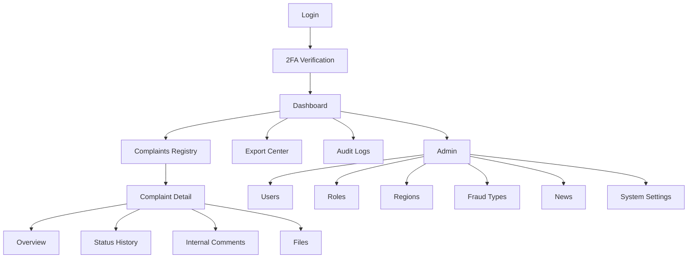

# Workspace Web UI/UX Specification
## SaqBol.kz

**Версия:** 1.0  
**Статус:** Workspace Web Product + UX + Frontend Specification  
**Цель:** спроектировать закрытую рабочую сторону SaqBol.kz для операторов, руководителей и администраторов  
**Технологии:** Next.js, React, TypeScript, Tailwind CSS, dashboard UI, RBAC-aware navigation

---

## 0. Продуктовый и визуальный подход

### 0.1. Роль Workspace Web

Workspace Web должен обеспечивать:

- быстрый и безопасный вход сотрудников;
- оперативную обработку большого объема обращений;
- минимальное количество кликов для типовых действий;
- высокую плотность данных без потери читаемости;
- полную трассируемость действий через audit и историю изменений.

### 0.2. UX-принципы

- **Speed-first**: оператор должен выполнять типовые действия из таблицы и карточки без лишних переходов.
- **Decision support**: интерфейс подсказывает следующий лучший шаг по жалобе.
- **Role-aware UI**: навигация, таблицы и действия меняются в зависимости от роли и permission set.
- **Dense but readable**: много данных на экране, но с четкой иерархией и визуальными акцентами.
- **Context preservation**: фильтры, табы и позиция в реестре сохраняются при возврате из карточки.
- **Audit by design**: все значимые действия сопровождаются прозрачными индикаторами, метаданными и историей.

### 0.3. Визуальное направление

Стиль интерфейса:

- enterprise;
- строгий;
- быстрый;
- функциональный;
- ориентированный на длительную рабочую сессию;
- без избыточной декоративности.

### 0.4. Визуальная система

#### Typography

- Основной шрифт: `IBM Plex Sans`
- Моноширинный для ID, номеров и технических значений: `IBM Plex Mono`

#### Color direction

```css
:root {
  --bg: #eef3f4;
  --surface: #ffffff;
  --surface-2: #f7fafb;
  --surface-3: #e8eff2;
  --text: #102430;
  --text-muted: #5d6c76;
  --primary: #0c5966;
  --primary-strong: #083c47;
  --accent: #c48a24;
  --border: #d6e0e5;
  --success: #29764d;
  --warning: #ab7417;
  --danger: #b23d3d;
  --info: #266f94;
}
```

#### Layout tone

- светлый фон;
- четкие контуры панелей;
- функциональные цвета статусов;
- минималистичные иконки;
- жесткая сетка и predictable spacing.

---

## 1. Sitemap workspace

### 1.1. Основной sitemap

```text
/login
/2fa
/dashboard
/complaints
|-- /complaints/[id]
|-- /complaints/[id]?tab=overview
|-- /complaints/[id]?tab=history
|-- /complaints/[id]?tab=comments
|-- /complaints/[id]?tab=files
/exports
/audit
/admin
|-- /admin/users
|-- /admin/users/[id]
|-- /admin/roles
|-- /admin/dictionaries/regions
|-- /admin/dictionaries/fraud-types
|-- /admin/news
|-- /admin/news/[id]
|-- /admin/settings
```

### 1.2. Навигационные группы

#### Core Operations

- Dashboard
- Реестр жалоб
- Экспорт

#### Control & Audit

- Audit Logs

#### Administration

- Пользователи
- Роли
- Регионы
- Типы мошенничества
- Новости
- Настройки системы

### 1.3. Role-aware navigation

#### OPERATOR

- Dashboard
- Реестр жалоб
- Экспорт

#### SUPERVISOR

- Dashboard
- Реестр жалоб
- Экспорт
- Audit Logs (если разрешено policy)

#### ADMIN

- Dashboard
- Реестр жалоб
- Экспорт
- Audit Logs
- Пользователи
- Роли
- Регионы
- Типы мошенничества
- Новости
- Настройки системы

### 1.4. Sitemap в виде mermaid



---

## 2. RBAC matrix для экранов

### 2.1. Роли

- `OPERATOR`
- `SUPERVISOR`
- `ADMIN`

### 2.2. Матрица доступа

| Экран / Раздел | OPERATOR | SUPERVISOR | ADMIN |
|---|---|---|---|
| Страница входа | Да | Да | Да |
| 2FA verification | Да | Да | Да |
| Dashboard | Да | Да | Да |
| Реестр жалоб | Да | Да | Да |
| Карточка жалобы | Да | Да | Да |
| История статусов | Да | Да | Да |
| Внутренние комментарии | Да | Да | Да |
| Изменение статуса | Ограниченно | Да | Да |
| Назначение исполнителя | Нет / Ограниченно по policy | Да | Да |
| Запрос доп. информации | Да | Да | Да |
| Export center | Да | Да | Да |
| Audit logs | Нет | Ограниченно | Да |
| Управление пользователями | Нет | Нет | Да |
| Управление ролями | Нет | Нет | Да |
| Управление регионами | Нет | Нет | Да |
| Управление типами мошенничества | Нет | Нет | Да |
| Управление новостями | Нет | Нет / Ограниченно | Да |
| Настройки системы | Нет | Нет | Да |

### 2.3. Важное замечание

RBAC на уровне экрана недостаточен. Нужны еще:

- permission checks на уровне action buttons;
- object-level access в пределах зоны ответственности;
- скрытие или disable опасных действий без прав;
- серверная авторизация как источник истины.

### 2.4. RBAC для ключевых действий

| Действие | OPERATOR | SUPERVISOR | ADMIN |
|---|---|---|---|
| Просмотр assigned complaints | Да | Да | Да |
| Просмотр всех complaints | По scope | Да | Да |
| Смена статуса `NEW -> UNDER_REVIEW` | Да | Да | Да |
| Смена terminal statuses | Нет / По policy | Да | Да |
| Назначение исполнителя | Нет / limited | Да | Да |
| Просмотр audit raw events | Нет | Limited | Да |
| Export complaints | Да | Да | Да |
| Управление ролями | Нет | Нет | Да |
| Изменение system settings | Нет | Нет | Да |

---

## 3. Dashboard metrics

### 3.1. Главная цель dashboard

Dashboard должен отвечать на 4 вопроса:

1. Что требует немедленного внимания?
2. Где просрочки и узкие места?
3. Как распределена текущая нагрузка?
4. Какие категории и регионы дают наибольший поток?

### 3.2. KPI cards

#### Для OPERATOR

- Мои новые жалобы
- Мои жалобы в работе
- Требуют информации
- Просроченные
- Среднее время до первого действия

#### Для SUPERVISOR

- Новые жалобы по подразделению
- Просроченные по SLA
- Не назначенные жалобы
- Загрузка исполнителей
- Завершено за период

#### Для ADMIN

- Все новые жалобы
- Все просроченные
- Количество активных сотрудников
- Топ-регионы по жалобам
- Топ-типы мошенничества
- Системные ошибки / сбои интеграций при наличии

### 3.3. Dashboard widgets

- Status distribution chart
- Region heat table / bar chart
- Fraud type distribution
- Queue by assignee
- SLA risk list
- Recent activity stream
- Latest high-risk complaints

### 3.4. Recommended layout

1. Header row:
   - date range;
   - region filter;
   - team filter;
   - refresh button.

2. KPI cards grid.

3. Main middle row:
   - complaints by status;
   - workload by assignee.

4. Secondary row:
   - by region;
   - by fraud type.

5. Bottom row:
   - urgent queue;
   - recent audit / recent operational events.

### 3.5. Dashboard refresh behavior

- auto refresh каждые 30-60 секунд для live queue blocks;
- manual refresh для expensive widgets;
- subtle freshness indicator `Updated 13:04`.

---

## 4. Таблицы и фильтры

### 4.1. Реестр жалоб

Реестр жалоб является центральным рабочим экраном.

### 4.2. Основные колонки таблицы

- Номер жалобы
- Дата создания
- Заявитель
- Регион
- Тип мошенничества
- Текущий статус
- Приоритет / SLA indicator
- Назначенный исполнитель
- Последнее обновление
- Действия

### 4.3. Sticky behavior

- sticky header таблицы;
- sticky first column с complaint number;
- sticky filter bar;
- сохранение горизонтального скролла на больших таблицах.

### 4.4. Основные фильтры

- Поиск по номеру жалобы
- Поиск по ФИО / телефону / email / реквизиту
- Статус
- Регион
- Тип мошенничества
- Исполнитель
- Период создания
- Период последнего обновления
- Только просроченные
- Только не назначенные
- Только мои

### 4.5. Advanced filters

- Канал поступления
- Сумма ущерба диапазоном
- Есть вложения
- Есть запрос доп. информации
- Есть дубликат
- Terminal / non-terminal

### 4.6. Saved views

Рекомендуемые пресеты:

- Мои новые
- Требуют действия сегодня
- Просроченные
- Без исполнителя
- NEED_INFO
- Дубликаты

### 4.7. Table actions

#### Row-level

- Открыть карточку
- Быстрая смена статуса
- Назначить исполнителя
- Экспорт карточки

#### Bulk

- Экспорт selection
- Назначить исполнителя
- Сменить статус, если policy допускает

### 4.8. Table patterns

- virtualization при больших объемах;
- compact row height с expandable preview;
- color-coded status chips;
- SLA risk marker слева от строки;
- keyboard navigation по строкам.

---

## 5. Карточка жалобы

### 5.1. Цель карточки

Карточка должна позволять сотруднику:

- быстро понять контекст обращения;
- принять решение;
- выполнить действия без переключения между многими экранами;
- увидеть историю и обоснование предыдущих шагов.

### 5.2. Структура страницы

#### Верхняя панель

- complaint number;
- status badge;
- SLA badge;
- created at;
- last updated at;
- quick actions:
  - change status;
  - assign;
  - request info;
  - export.

#### Основная двухколоночная компоновка на desktop

Левая колонка:

- Overview
- Applicant info
- Incident details
- Suspicious contacts / entities
- Files

Правая колонка:

- Action panel
- Status history snapshot
- Internal comments preview
- Related complaints / duplicate info
- Risk indicators

### 5.3. Tabs / sections

Рекомендуемые вкладки:

- `Overview`
- `History`
- `Comments`
- `Files`
- `Audit` при наличии права

### 5.4. Overview content

- основные данные заявителя;
- fraud type;
- регион;
- incident date/time;
- damage amount;
- contact list;
- full narrative;
- linked blacklist results;
- duplicate linkage if exists.

### 5.5. Action panel

Action panel закреплен справа и содержит:

- статус сейчас;
- next available statuses;
- assign current assignee;
- request additional info button;
- warnings;
- policy hints.

### 5.6. History section

Таймлайн:

- from -> to status;
- timestamp;
- actor;
- reason code/text;
- internal markers;
- audit-linked event id if applicable.

### 5.7. Internal comments

Комментарии должны поддерживать:

- reverse chronological view;
- author + timestamp;
- mention-like quick context tags;
- system comments отдельно;
- internal attachment chips при необходимости.

### 5.8. Files section

- attachments list;
- scan status;
- preview for images/PDF when possible;
- download action;
- internal-only mark.

### 5.9. Mobile adaptation of complaint detail

- action panel переносится в sticky bottom actions;
- overview идет аккордеонами;
- tabs превращаются в segmented sticky header;
- comments и history открываются в full-page sections.

---

## 6. UX обработки жалобы

### 6.1. Основной рабочий сценарий оператора

1. Оператор заходит в dashboard.
2. Переходит в preset `Мои новые`.
3. Открывает жалобу.
4. Просматривает summary и suspicious entities.
5. Переводит жалобу в `UNDER_REVIEW`.
6. При необходимости:
   - пишет internal comment;
   - запрашивает доп. информацию;
   - передает руководителю/ожидает назначения.

### 6.2. Основной сценарий руководителя

1. Руководитель открывает queue `Без исполнителя`.
2. Смотрит SLA risk и сложность.
3. Назначает исполнителя.
4. Контролирует переход `ASSIGNED -> IN_PROGRESS -> RESOLVED/REJECTED/DUPLICATE`.

### 6.3. UX-принципы обработки

- ключевые действия доступны из карточки и из таблицы;
- после действия UI не теряет контекст;
- success feedback короткий и ненавязчивый;
- при invalid transition UI объясняет, почему действие недоступно;
- обязательно показывать последствия изменения статуса.

### 6.4. Quick actions from registry

Из таблицы без перехода в detail, если policy разрешает:

- назначить исполнителя;
- изменить статус на ближайший допустимый;
- открыть quick preview drawer;
- поставить флаг `требует внимания`.

### 6.5. Modal vs drawer strategy

- quick actions: modal;
- short preview: right drawer;
- full detail: page navigation;
- bulk actions: modal with summary table.

### 6.6. UX для `NEED_INFO`

При запросе доп. информации:

- modal с reason code и message template;
- preview citizen-visible text;
- индикатор, что жалоба уйдет в `NEED_INFO`;
- отправка уведомления;
- автоматическое появление timeline event.

### 6.7. UX для `DUPLICATE`

- поиск основной жалобы через searchable modal;
- preview найденной жалобы;
- предупреждение о необратимости / policy restrictions;
- обязательное подтверждение.

---

## 7. UI states

### 7.1. Status design

Рекомендуемая цветовая система:

- `NEW` -> sky
- `UNDER_REVIEW` -> amber
- `NEED_INFO` -> orange
- `ASSIGNED` -> indigo
- `IN_PROGRESS` -> cyan
- `RESOLVED` -> green
- `REJECTED` -> red
- `DUPLICATE` -> slate

### 7.2. Priority / SLA states

- normal;
- warning;
- overdue.

Отображение:

- слева тонкая полоса цвета;
- иконка времени;
- tooltip с SLA details.

### 7.3. Form action states

- pristine;
- dirty;
- saving;
- saved;
- failed save.

### 7.4. Async UI states

- background refresh in table;
- export generating;
- file preview loading;
- assignment search loading;
- audit table streaming / loading next page.

---

## 8. Empty/error/loading states

### 8.1. Loading states

#### Dashboard

- skeleton KPI cards;
- chart skeletons;
- lightweight shimmer for activity list.

#### Registry

- dense table skeleton;
- sticky filter bar stays visible;
- preserving previous result view during refetch preferred.

#### Complaint detail

- header skeleton;
- side action panel skeleton;
- timeline placeholders.

### 8.2. Empty states

#### No complaints in filtered queue

- text: `По текущим фильтрам обращений не найдено`
- CTA: `Сбросить фильтры`
- alternative CTA: `Открыть все обращения`

#### No exports

- text: `Экспортов пока нет`
- CTA: `Создать экспорт`

#### No audit results

- text: `Нет событий по заданным параметрам`
- CTA: `Изменить фильтры`

### 8.3. Error states

- data fetch failed;
- permission denied;
- record not found;
- action conflict;
- stale data warning;
- export failed.

Каждый error state должен содержать:

- понятный заголовок;
- краткое объяснение;
- request id при критических ошибках;
- retry action;
- fallback navigation.

### 8.4. Partial failure states

- история загрузилась, comments нет;
- карточка загрузилась, файлы временно недоступны;
- dashboard metrics есть, charts нет.

UI не должен ломать весь экран из-за частичного отказа.

---

## 9. Notification patterns

### 9.1. In-app patterns

- toast для коротких операций;
- inline banner для policy warnings;
- modal confirmation для irreversible / sensitive actions;
- notification center для system-level событий.

### 9.2. Recommended usage

- `toast success`: статус обновлен, комментарий сохранен;
- `toast error`: операция не выполнена;
- `inline warning`: истекает SLA, конфликт данных, stale view;
- `modal confirmation`: duplicate, reject, role change, system setting update.

### 9.3. Real-time hints

При желании future-ready:

- badge on notification bell;
- live queue refresh indicator;
- subtle toast for newly assigned complaint.

### 9.4. Escalation language

Тон уведомлений:

- нейтральный;
- деловой;
- короткий;
- без эмоциональной окраски.

---

## 10. Audit visibility

### 10.1. Общий подход

Audit должен быть видим там, где он помогает принятию решения:

- в общей таблице audit logs;
- в карточке жалобы через `Audit` tab;
- в modal history для критичных действий;
- в admin screens для изменений ролей и настроек.

### 10.2. Audit logs table columns

- Timestamp
- Actor
- Action type
- Entity type
- Entity id
- Request id
- IP
- Result / status code
- Metadata preview

### 10.3. Audit detail drawer

При клике по событию открывается drawer с:

- полным action type;
- old/new values diff;
- request metadata;
- linked entity navigation;
- JSON raw view.

### 10.4. Audit visibility by role

- OPERATOR: не видит общий audit module, но видит limited trace в своей карточке при policy;
- SUPERVISOR: limited access к operational audit;
- ADMIN: полный access.

### 10.5. UX правила

- audit data read-only;
- no inline editing;
- no destructive actions;
- sensitive fields masked where required.

---

## 11. Пример структуры frontend workspace

```text
apps/workspace-web/
  src/
    app/
      (auth)/
        login/
          page.tsx
        two-factor/
          page.tsx
      (workspace)/
        dashboard/
          page.tsx
        complaints/
          page.tsx
          [id]/
            page.tsx
        exports/
          page.tsx
        audit/
          page.tsx
        admin/
          users/
            page.tsx
            [id]/
              page.tsx
          roles/
            page.tsx
          dictionaries/
            regions/
              page.tsx
            fraud-types/
              page.tsx
          news/
            page.tsx
            [id]/
              page.tsx
          settings/
            page.tsx
        layout.tsx
    components/
      layout/
      dashboard/
      complaints/
      audit/
      admin/
      forms/
      tables/
      feedback/
      primitives/
    features/
      auth/
      dashboard/
      complaints-registry/
      complaint-detail/
      complaint-workflow/
      exports/
      audit/
      admin-users/
      admin-roles/
      admin-dictionaries/
      admin-news/
      admin-settings/
    hooks/
      use-rbac.ts
      use-table-state.ts
      use-dashboard-filters.ts
      use-complaint-actions.ts
      use-toast.ts
    lib/
      api/
        client.ts
        auth.ts
        complaints.ts
        stats.ts
        audit.ts
        exports.ts
        admin.ts
      rbac/
        permissions.ts
        navigation.ts
      utils/
      formatters/
      validations/
    styles/
      globals.css
      tokens.css
  middleware.ts
  next.config.ts
  tailwind.config.ts
  package.json
```

### 11.1. Frontend recommendations

- App Router;
- server components for initial page framing and filters where beneficial;
- client components for tables, drawers, modals, charts and live actions;
- `tanstack-query` for server state;
- table state synced with URL params;
- `react-hook-form + zod` for modals/forms;
- centralized `use-rbac` for nav visibility and action visibility.

---

## 12. Примеры React-компонентов

### 12.1. Admin layout

```tsx
// src/components/layout/admin-layout.tsx
import Link from "next/link";
import { ReactNode } from "react";

type NavItem = {
  href: string;
  label: string;
  permissions?: string[];
};

const NAV_ITEMS: NavItem[] = [
  { href: "/dashboard", label: "Dashboard" },
  { href: "/complaints", label: "Жалобы" },
  { href: "/exports", label: "Экспорт" },
  { href: "/audit", label: "Audit", permissions: ["audit.read"] },
  { href: "/admin/users", label: "Пользователи", permissions: ["user.manage.staff"] },
  { href: "/admin/roles", label: "Роли", permissions: ["role.manage"] },
  { href: "/admin/dictionaries/regions", label: "Регионы", permissions: ["reference.manage"] },
  { href: "/admin/dictionaries/fraud-types", label: "Типы мошенничества", permissions: ["reference.manage"] },
  { href: "/admin/news", label: "Новости", permissions: ["news.manage"] },
  { href: "/admin/settings", label: "Настройки", permissions: ["settings.manage"] },
];

function hasAccess(userPermissions: string[], item: NavItem) {
  if (!item.permissions?.length) return true;
  return item.permissions.some((permission) => userPermissions.includes(permission));
}

export function AdminLayout({
  children,
  userPermissions,
}: {
  children: ReactNode;
  userPermissions: string[];
}) {
  return (
    <div className="min-h-screen bg-[var(--bg)] text-[var(--text)]">
      <div className="grid min-h-screen lg:grid-cols-[280px_1fr]">
        <aside className="border-r border-[var(--border)] bg-[var(--primary-strong)] text-white">
          <div className="border-b border-white/10 px-5 py-5">
            <div className="text-lg font-semibold tracking-tight">SaqBol Workspace</div>
            <div className="mt-1 text-xs text-white/70">Служебный контур</div>
          </div>

          <nav className="space-y-1 p-3">
            {NAV_ITEMS.filter((item) => hasAccess(userPermissions, item)).map((item) => (
              <Link
                key={item.href}
                href={item.href}
                className="flex items-center rounded-xl px-3 py-2.5 text-sm font-medium text-white/85 transition hover:bg-white/10 hover:text-white"
              >
                {item.label}
              </Link>
            ))}
          </nav>
        </aside>

        <div className="min-w-0">
          <header className="sticky top-0 z-30 flex h-16 items-center justify-between border-b border-[var(--border)] bg-white/95 px-4 backdrop-blur sm:px-6">
            <div>
              <div className="text-sm font-semibold">Операционный контур</div>
              <div className="text-xs text-[var(--text-muted)]">Управление жалобами и администрирование</div>
            </div>

            <div className="flex items-center gap-3">
              <button className="rounded-xl border border-[var(--border)] px-3 py-2 text-sm">
                Уведомления
              </button>
              <button className="rounded-xl border border-[var(--border)] px-3 py-2 text-sm">
                Профиль
              </button>
            </div>
          </header>

          <main className="p-4 sm:p-6">{children}</main>
        </div>
      </div>
    </div>
  );
}
```

### 12.2. Complaints table

```tsx
// src/components/complaints/complaints-table.tsx
type ComplaintRow = {
  id: string;
  complaintNumber: string;
  createdAt: string;
  applicantName: string;
  region: string;
  fraudType: string;
  status: string;
  assignee?: string;
  slaState: "NORMAL" | "WARNING" | "OVERDUE";
  updatedAt: string;
};

const slaClassMap = {
  NORMAL: "bg-emerald-500",
  WARNING: "bg-amber-500",
  OVERDUE: "bg-rose-500",
};

export function ComplaintsTable({
  rows,
}: {
  rows: ComplaintRow[];
}) {
  return (
    <div className="overflow-hidden rounded-2xl border border-[var(--border)] bg-white shadow-sm">
      <div className="border-b border-[var(--border)] bg-[var(--surface-2)] px-4 py-3">
        <div className="flex flex-wrap items-center justify-between gap-3">
          <div className="text-sm font-semibold">Реестр жалоб</div>
          <div className="flex flex-wrap gap-2">
            <input
              placeholder="Поиск по номеру, ФИО, телефону..."
              className="h-10 rounded-xl border border-[var(--border)] px-3 text-sm"
            />
            <button className="rounded-xl border border-[var(--border)] px-3 py-2 text-sm">Фильтры</button>
            <button className="rounded-xl bg-[var(--primary)] px-3 py-2 text-sm font-semibold text-white">
              Экспорт
            </button>
          </div>
        </div>
      </div>

      <div className="overflow-x-auto">
        <table className="min-w-full text-sm">
          <thead className="bg-[var(--surface-2)] text-left text-[var(--text-muted)]">
            <tr>
              <th className="px-4 py-3">SLA</th>
              <th className="px-4 py-3">Номер</th>
              <th className="px-4 py-3">Создано</th>
              <th className="px-4 py-3">Заявитель</th>
              <th className="px-4 py-3">Регион</th>
              <th className="px-4 py-3">Тип</th>
              <th className="px-4 py-3">Статус</th>
              <th className="px-4 py-3">Исполнитель</th>
              <th className="px-4 py-3">Обновлено</th>
              <th className="px-4 py-3">Действия</th>
            </tr>
          </thead>
          <tbody>
            {rows.map((row) => (
              <tr key={row.id} className="border-t border-[var(--border)] hover:bg-[var(--surface-2)]">
                <td className="px-4 py-3">
                  <div className={`h-8 w-1.5 rounded-full ${slaClassMap[row.slaState]}`} />
                </td>
                <td className="px-4 py-3 font-mono font-semibold">{row.complaintNumber}</td>
                <td className="px-4 py-3">{row.createdAt}</td>
                <td className="px-4 py-3">{row.applicantName}</td>
                <td className="px-4 py-3">{row.region}</td>
                <td className="px-4 py-3">{row.fraudType}</td>
                <td className="px-4 py-3">
                  <span className="rounded-full bg-[var(--surface-3)] px-2.5 py-1 text-xs font-semibold">
                    {row.status}
                  </span>
                </td>
                <td className="px-4 py-3">{row.assignee ?? "Не назначен"}</td>
                <td className="px-4 py-3 text-[var(--text-muted)]">{row.updatedAt}</td>
                <td className="px-4 py-3">
                  <div className="flex gap-2">
                    <button className="rounded-lg border border-[var(--border)] px-2.5 py-1.5 text-xs">
                      Открыть
                    </button>
                    <button className="rounded-lg border border-[var(--border)] px-2.5 py-1.5 text-xs">
                      Статус
                    </button>
                  </div>
                </td>
              </tr>
            ))}
          </tbody>
        </table>
      </div>
    </div>
  );
}
```

### 12.3. Complaint detail panel

```tsx
// src/components/complaints/complaint-detail-panel.tsx
type ComplaintDetailPanelProps = {
  complaintNumber: string;
  status: string;
  applicantName: string;
  applicantContacts: string[];
  description: string;
  region: string;
  fraudType: string;
  assignee?: string;
};

export function ComplaintDetailPanel(props: ComplaintDetailPanelProps) {
  return (
    <div className="grid gap-6 xl:grid-cols-[minmax(0,1fr)_360px]">
      <section className="space-y-6">
        <div className="rounded-2xl border border-[var(--border)] bg-white p-5 shadow-sm">
          <div className="flex flex-wrap items-start justify-between gap-4">
            <div>
              <div className="text-xs uppercase tracking-[0.16em] text-[var(--text-muted)]">Жалоба</div>
              <div className="mt-2 font-mono text-lg font-semibold">{props.complaintNumber}</div>
            </div>
            <span className="rounded-full bg-[var(--surface-3)] px-3 py-1 text-sm font-semibold">
              {props.status}
            </span>
          </div>

          <dl className="mt-6 grid gap-4 sm:grid-cols-2">
            <div>
              <dt className="text-xs uppercase tracking-wide text-[var(--text-muted)]">Заявитель</dt>
              <dd className="mt-1 text-sm font-medium">{props.applicantName}</dd>
            </div>
            <div>
              <dt className="text-xs uppercase tracking-wide text-[var(--text-muted)]">Регион</dt>
              <dd className="mt-1 text-sm font-medium">{props.region}</dd>
            </div>
            <div>
              <dt className="text-xs uppercase tracking-wide text-[var(--text-muted)]">Тип мошенничества</dt>
              <dd className="mt-1 text-sm font-medium">{props.fraudType}</dd>
            </div>
            <div>
              <dt className="text-xs uppercase tracking-wide text-[var(--text-muted)]">Исполнитель</dt>
              <dd className="mt-1 text-sm font-medium">{props.assignee ?? "Не назначен"}</dd>
            </div>
          </dl>
        </div>

        <div className="rounded-2xl border border-[var(--border)] bg-white p-5 shadow-sm">
          <h2 className="text-sm font-semibold">Описание инцидента</h2>
          <p className="mt-3 whitespace-pre-wrap text-sm leading-6 text-[var(--text)]">
            {props.description}
          </p>
        </div>

        <div className="rounded-2xl border border-[var(--border)] bg-white p-5 shadow-sm">
          <h2 className="text-sm font-semibold">Подозрительные контакты и реквизиты</h2>
          <div className="mt-3 flex flex-wrap gap-2">
            {props.applicantContacts.map((contact) => (
              <span key={contact} className="rounded-full bg-[var(--surface-2)] px-3 py-1.5 text-sm">
                {contact}
              </span>
            ))}
          </div>
        </div>
      </section>

      <aside className="space-y-4">
        <div className="sticky top-20 rounded-2xl border border-[var(--border)] bg-white p-5 shadow-sm">
          <h2 className="text-sm font-semibold">Действия</h2>
          <div className="mt-4 grid gap-2">
            <button className="rounded-xl bg-[var(--primary)] px-4 py-2.5 text-sm font-semibold text-white">
              Изменить статус
            </button>
            <button className="rounded-xl border border-[var(--border)] px-4 py-2.5 text-sm">
              Назначить исполнителя
            </button>
            <button className="rounded-xl border border-[var(--border)] px-4 py-2.5 text-sm">
              Запросить информацию
            </button>
            <button className="rounded-xl border border-[var(--border)] px-4 py-2.5 text-sm">
              Экспорт
            </button>
          </div>

          <div className="mt-5 rounded-xl bg-[var(--surface-2)] p-4">
            <div className="text-xs uppercase tracking-wide text-[var(--text-muted)]">Подсказка</div>
            <p className="mt-2 text-sm leading-6 text-[var(--text-muted)]">
              Перед переводом в terminal status проверьте комментарии, вложения и наличие связанной жалобы.
            </p>
          </div>
        </div>
      </aside>
    </div>
  );
}
```

### 12.4. Status change modal

```tsx
// src/components/complaints/status-change-modal.tsx
"use client";

import { useState } from "react";

const statusOptions = [
  "UNDER_REVIEW",
  "NEED_INFO",
  "ASSIGNED",
  "IN_PROGRESS",
  "RESOLVED",
  "REJECTED",
  "DUPLICATE",
] as const;

export function StatusChangeModal({
  isOpen,
  onClose,
}: {
  isOpen: boolean;
  onClose: () => void;
}) {
  const [status, setStatus] = useState<(typeof statusOptions)[number]>("UNDER_REVIEW");
  const [reasonText, setReasonText] = useState("");

  if (!isOpen) return null;

  return (
    <div className="fixed inset-0 z-50 flex items-center justify-center bg-slate-950/40 p-4">
      <div className="w-full max-w-xl rounded-3xl border border-[var(--border)] bg-white shadow-2xl">
        <div className="border-b border-[var(--border)] px-6 py-4">
          <h2 className="text-lg font-semibold">Изменение статуса</h2>
          <p className="mt-1 text-sm text-[var(--text-muted)]">
            Укажите новый статус и при необходимости причину изменения.
          </p>
        </div>

        <div className="space-y-5 px-6 py-5">
          <label className="grid gap-2">
            <span className="text-sm font-medium">Новый статус</span>
            <select
              value={status}
              onChange={(event) => setStatus(event.target.value as (typeof statusOptions)[number])}
              className="h-11 rounded-xl border border-[var(--border)] px-3 text-sm"
            >
              {statusOptions.map((option) => (
                <option key={option} value={option}>
                  {option}
                </option>
              ))}
            </select>
          </label>

          <label className="grid gap-2">
            <span className="text-sm font-medium">Причина / комментарий</span>
            <textarea
              value={reasonText}
              onChange={(event) => setReasonText(event.target.value)}
              rows={5}
              className="rounded-xl border border-[var(--border)] px-3 py-3 text-sm"
              placeholder="Опишите причину изменения статуса"
            />
          </label>

          <div className="rounded-xl bg-[var(--surface-2)] p-4">
            <div className="text-xs uppercase tracking-wide text-[var(--text-muted)]">Важно</div>
            <p className="mt-2 text-sm text-[var(--text-muted)]">
              Действие будет отражено в истории статусов и журнале аудита.
            </p>
          </div>
        </div>

        <div className="flex items-center justify-end gap-3 border-t border-[var(--border)] px-6 py-4">
          <button
            type="button"
            onClick={onClose}
            className="rounded-xl border border-[var(--border)] px-4 py-2 text-sm"
          >
            Отмена
          </button>
          <button
            type="button"
            className="rounded-xl bg-[var(--primary)] px-4 py-2 text-sm font-semibold text-white"
          >
            Сохранить
          </button>
        </div>
      </div>
    </div>
  );
}
```

### 12.5. Audit log table

```tsx
// src/components/audit/audit-log-table.tsx
type AuditRow = {
  id: string;
  timestamp: string;
  actor: string;
  action: string;
  entityType: string;
  entityId: string;
  requestId: string;
  statusCode: number;
};

export function AuditLogTable({
  rows,
}: {
  rows: AuditRow[];
}) {
  return (
    <div className="overflow-hidden rounded-2xl border border-[var(--border)] bg-white shadow-sm">
      <div className="border-b border-[var(--border)] bg-[var(--surface-2)] px-4 py-3">
        <div className="flex flex-wrap items-center justify-between gap-3">
          <div className="text-sm font-semibold">Audit logs</div>
          <div className="flex flex-wrap gap-2">
            <input className="h-10 rounded-xl border border-[var(--border)] px-3 text-sm" placeholder="Action / Entity / Request ID" />
            <button className="rounded-xl border border-[var(--border)] px-3 py-2 text-sm">Фильтры</button>
          </div>
        </div>
      </div>

      <div className="overflow-x-auto">
        <table className="min-w-full text-sm">
          <thead className="bg-[var(--surface-2)] text-left text-[var(--text-muted)]">
            <tr>
              <th className="px-4 py-3">Время</th>
              <th className="px-4 py-3">Пользователь</th>
              <th className="px-4 py-3">Действие</th>
              <th className="px-4 py-3">Сущность</th>
              <th className="px-4 py-3">Entity ID</th>
              <th className="px-4 py-3">Request ID</th>
              <th className="px-4 py-3">HTTP</th>
            </tr>
          </thead>
          <tbody>
            {rows.map((row) => (
              <tr key={row.id} className="border-t border-[var(--border)] hover:bg-[var(--surface-2)]">
                <td className="px-4 py-3">{row.timestamp}</td>
                <td className="px-4 py-3">{row.actor}</td>
                <td className="px-4 py-3 font-medium">{row.action}</td>
                <td className="px-4 py-3">{row.entityType}</td>
                <td className="px-4 py-3 font-mono text-xs">{row.entityId}</td>
                <td className="px-4 py-3 font-mono text-xs text-[var(--text-muted)]">{row.requestId}</td>
                <td className="px-4 py-3">
                  <span className="rounded-full bg-[var(--surface-3)] px-2.5 py-1 text-xs font-semibold">
                    {row.statusCode}
                  </span>
                </td>
              </tr>
            ))}
          </tbody>
        </table>
      </div>
    </div>
  );
}
```

### 12.6. Dashboard cards

```tsx
// src/components/dashboard/dashboard-cards.tsx
type DashboardMetricCard = {
  id: string;
  title: string;
  value: string;
  delta?: string;
  tone?: "default" | "warning" | "danger" | "success";
};

const toneMap = {
  default: "border-[var(--border)]",
  warning: "border-amber-300",
  danger: "border-rose-300",
  success: "border-emerald-300",
};

export function DashboardCards({
  items,
}: {
  items: DashboardMetricCard[];
}) {
  return (
    <div className="grid gap-4 sm:grid-cols-2 xl:grid-cols-5">
      {items.map((item) => (
        <div
          key={item.id}
          className={`rounded-2xl border bg-white p-5 shadow-sm ${toneMap[item.tone ?? "default"]}`}
        >
          <div className="text-xs uppercase tracking-[0.16em] text-[var(--text-muted)]">
            {item.title}
          </div>
          <div className="mt-3 text-3xl font-semibold tracking-tight">{item.value}</div>
          {item.delta ? (
            <div className="mt-2 text-sm text-[var(--text-muted)]">{item.delta}</div>
          ) : null}
        </div>
      ))}
    </div>
  );
}
```

---

## 13. Дополнительные UX-рекомендации

### 13.1. Dense enterprise patterns

- keyboard shortcuts для power users на следующем этапе;
- inline row preview вместо лишней навигации;
- action clustering по частоте использования;
- one primary action на экран/модалку.

### 13.2. Conflict handling

Если запись изменилась другим сотрудником:

- показать stale data banner;
- предложить reload;
- не терять локально введенный комментарий.

### 13.3. Search behavior

- debounced quick search;
- advanced filters в drawer;
- filter chips сверху таблицы;
- clear all filters visible immediately.

---

## 14. Вывод

Workspace Web SaqBol.kz должен быть построен как строгий role-aware enterprise-интерфейс с высокой плотностью данных, быстрыми таблицами, устойчивыми рабочими сценариями и сильной опорой на audit и workflow-контекст.

Ключевые качества решения:

- минимизация лишних кликов;
- быстрое принятие решений по жалобам;
- понятные next actions;
- надежная role-aware навигация;
- удобная работа с большим потоком обращений;
- прозрачная история и аудит всех критичных действий.

### Следующий практический шаг

После утверждения этой спецификации рекомендуется подготовить:

- high-fidelity dashboard screens;
- complaint registry prototype;
- complaint detail prototype with actions;
- scaffold `apps/workspace-web`;
- frontend permission map и route protection layer.
